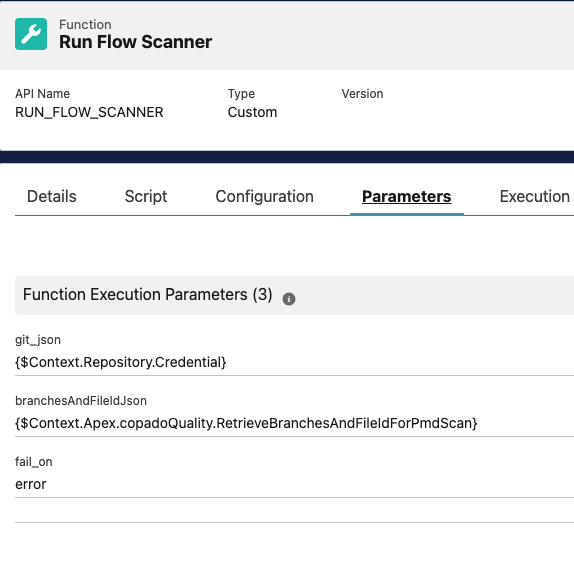
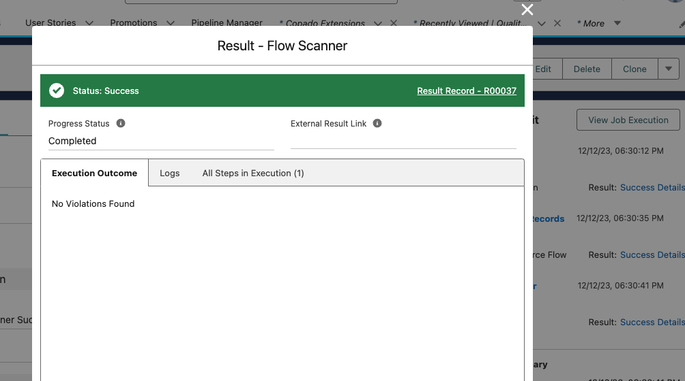
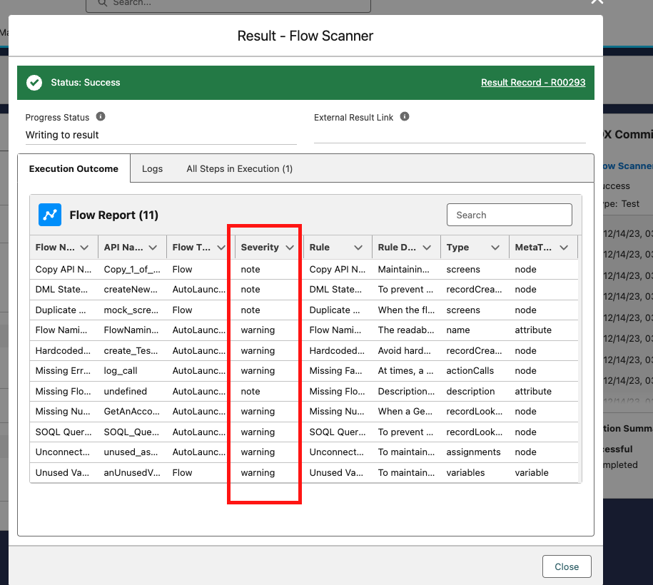
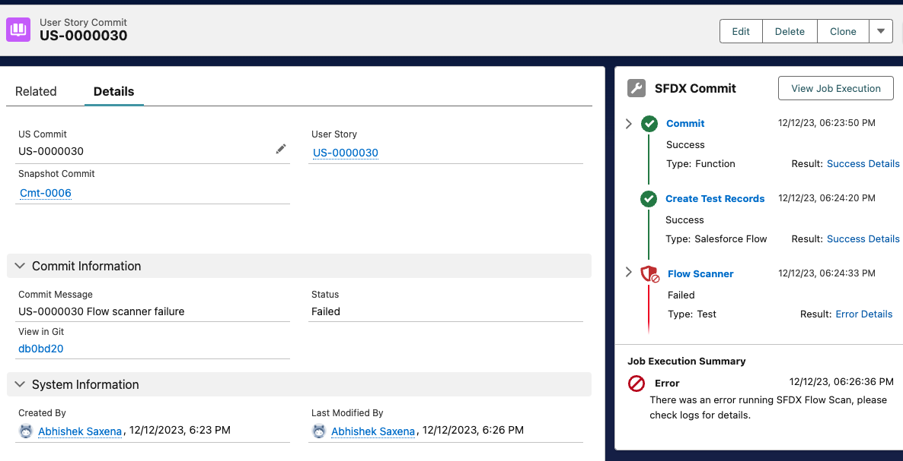
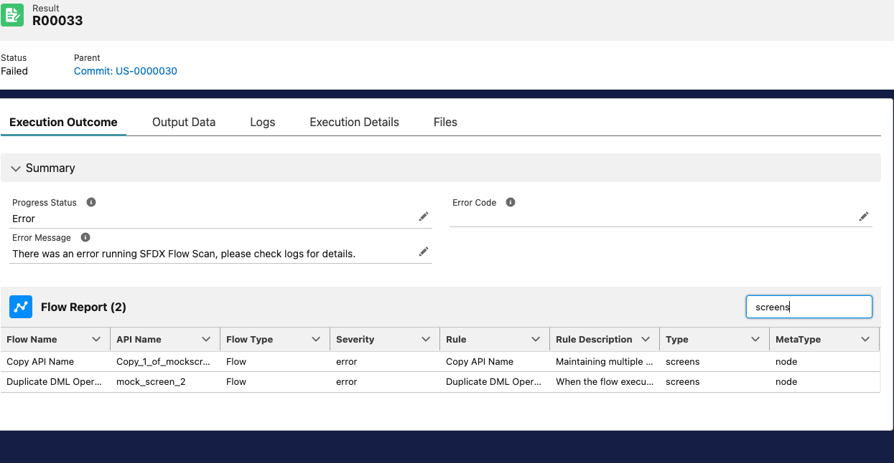

# Use Lightining Flow Scanner as a quality gate within Copado
Run it on the changed/updated components in your Copado User Story or enforce it before every deployment. All results are available within the Test and Result objects.

**Q: What is Lightining Flow Scanner?**

Lightning Flow Scanner is a free and open-source SFDX Plugin that can perform static analysis on Salesforce Flows, Process Builders and Workflows to identify violations of industry best practices. Please [read more about the original sfdx plugin here.](https://github.com/Lightning-Flow-Scanner/lightning-flow-scanner-sfdx)

## Rule overview
Read all the latest rules that are supported [here, in the core repo](https://lightning-flow-scanner.github.io/lightning-flow-scanner-core/#default-rules)

# Installing the Extension

## Pre-Requisites
* Install Copado v21.14 or higher
* Install Copado Quality Tools extension v1.42 or higher
* Install the [latest version of Copado Flow Scanner](https://success.copado.com/s/listing-detail?recordId=a54P7000003G3gBIAS) from Copado's DevOps Exchange by clicking the `Get It Now` button.

## Picklist Values

Create the Following Picklist values
* **Object: Extension Configuration** > Field: Extension Tool, Value: `flow-scanner`
* **Picklist Value Set** > Copado Test Tool, Value: `flow-scanner`

## Create The Functions and Job Templates
Navigate to the “Copado Extensions” tab, select “CopadoFlowScanner” and press the button “Generate Extension Records”.

## Configure Acceptance Criteria via a Function Parameter
 

`fail_on` - This parameter can take one of three rule severity values - `error`, `note` or `warning`. The default value of it is `error`. This parameter decides when should the Quality Gate fail.

  - Setting it to `error` means - Succeed the Quality Gate, if their are no violations or they are only of type `warning` or `note`. Fail on violations of severity `error`.
  - Setting it to `warning` means - Succeed the Quality Gate, if their are no violations or they are only of type or `note`. Fail on violations of severity `error` or `warning`.
  - Setting it to `note` means - Succeed the Quality Gate, if their are no violations. Fail on any violations irrespective of severity.

## How to set Severity of each rule?

By default, all rules have a severity of `error`. If you need to customize individual rule severity, then, in the root of your repo you could create `.flow-scanner.json`. [Here's a sample file](./.flow-scanner.json)

You can also configure `exceptions` for particular rules. [Read more details here.](https://github.com/Lightning-Flow-Scanner/lightning-flow-scanner-sfdx?tab=readme-ov-file#configuration)

## Configure the Quality Gate

### Create the Quality Gate Rule
Navigate to the Quality Gate Rules tab and create a new record as follows. Note that the Type field will be populated automatically upon save. The global value set Test Tool should have a value for `Flow Scanner` as part of this package. It can be created manually if necessary.

### Create the Quality Gate Rule Condition
Set the conditions so that it only applies to `Pipelines/Stages/Environments` with Platform = `SFDX`. This picklist value can be added manually if necessary.
Once saved, press the button “Activate” on the Quality Gate Rule record.
To run Flow Scanner only when Flows are committed, add the Filter Logic as shown in the picture below.

**You are all set.**

To test the configuration, just perform a commit which contains Flows on a user story on a SFDX platform Pipeline, and the Commit Action will call `Flow Scanner` after every commit.

Take a look at sample-test flows in the [test-data directory](./test-data/flows/).

## Demo

[Take a look at this recording to see how it works](https://www.loom.com/share/d5fc87459e714e94b72abcd5511be5d8)

Here are some screencaps of how the results look.
### Successful run with no violations and it's result

### Successful run with `warnings` and `note` type of violations and fail_on set to `error`

### Run with Violations

The Result record can be further opened to read the violations better, as well as wrap text and search to filter violations.

