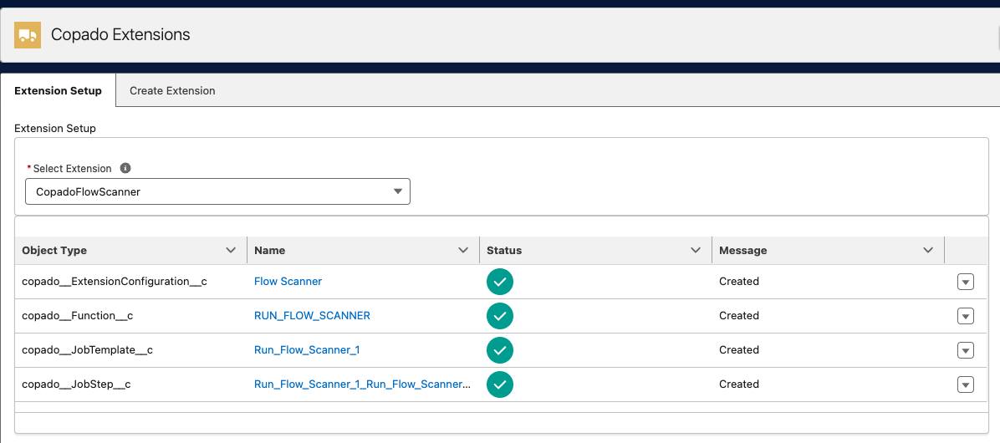
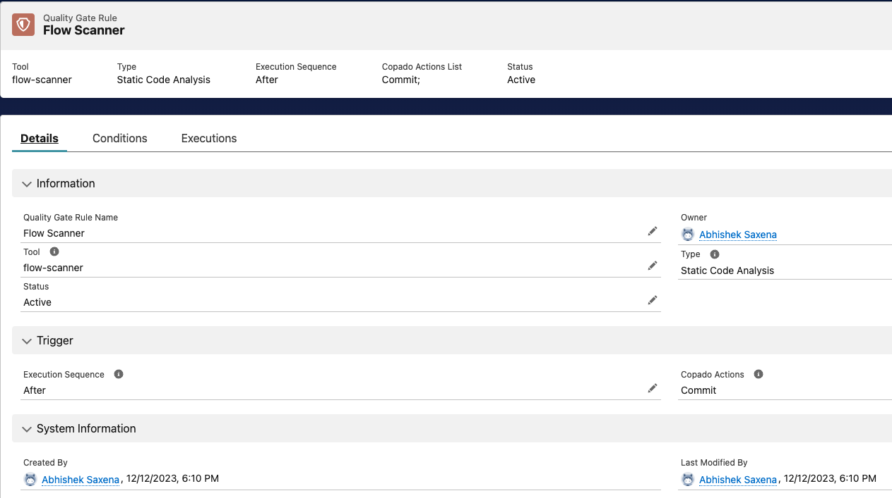
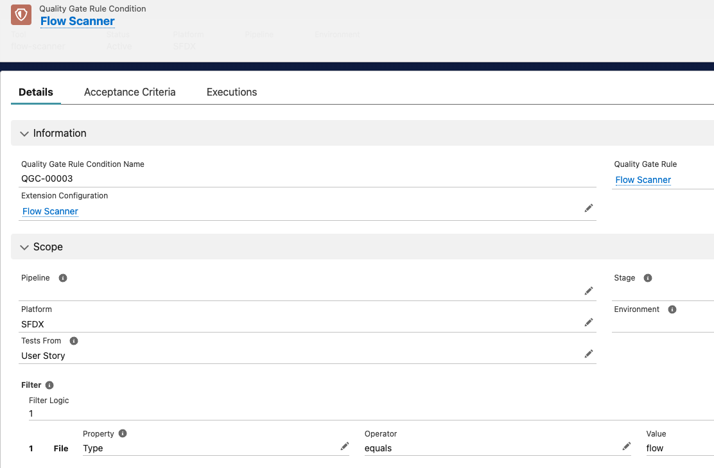
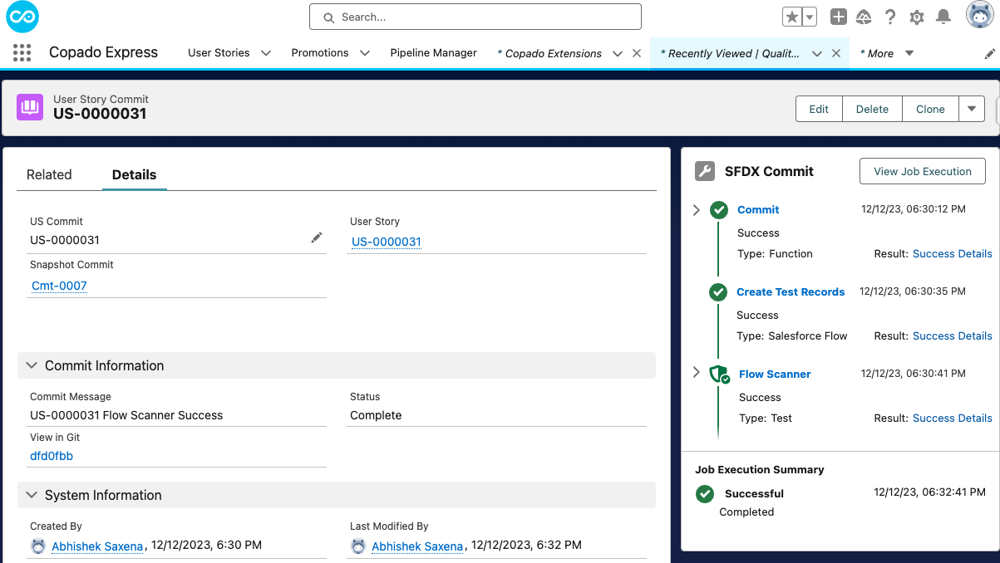
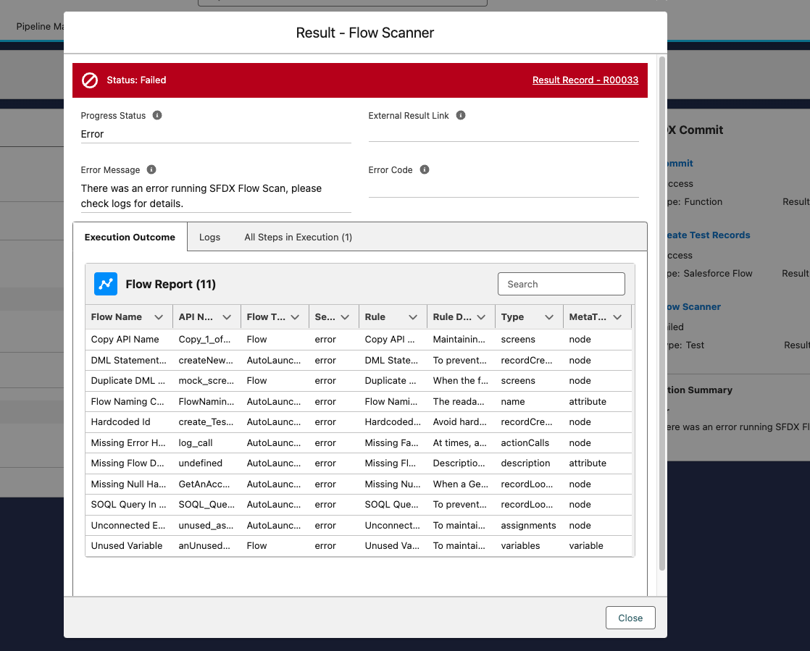
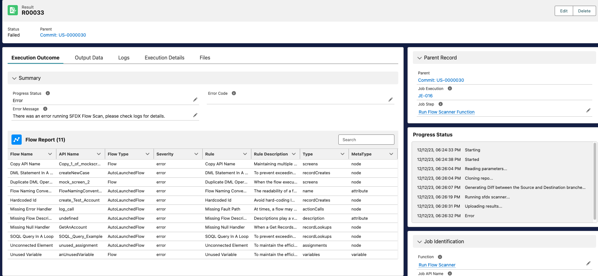
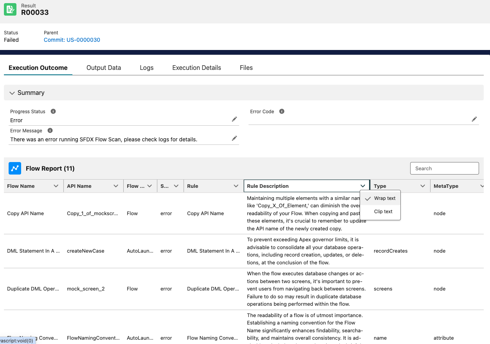

With this project, you can use Lightining Flow Scanner as a quality gate within Copado, and run it on the changed/updated components in your Copado User Story or enforce it before every deployment. All results are available within the Test and Result objects.

**Q: What is Lightining Flow Scanner?**

Lightning Flow Scanner is a free and open-source SFDX Plugin that can perform static analysis on Salesforce Flows, Process Builders and Workflows to identify violations of industry best practices. Please [read more about the original sfdx plugin here.](https://github.com/Lightning-Flow-Scanner/lightning-flow-scanner-sfdx)

# Installing the Extension

## Pre-Requisites
* Install Copado v21.14 or higher
* Install Copado Quality Tools extension v1.42 or higher
* Install the [latest version of Copado Flow Scanner](https://login.salesforce.com/packaging/installPackage.apexp?p0=04t8Z000000BoooQAC) from Copado's DevOps Exchange.

## Picklist Values

* Create the Following Picklist values
* Object: Extension Configuration, Field: Extension Tool, Value: `flow-scanner`
* Picklist Value Set: Copado Test Tool, Value: `flow-scanner`

## Create The Functions and Job Templates
Navigate to the “Copado Extensions” tab, select “CopadoFlowScanner” and press the button “Generate Extension Records”.

## Configure the Quality Gate

### Create the Quality Gate Rule
Navigate to the Quality Gate Rules tab and create a new record as follows. Note that the Type field will be populated automatically upon save. The global value set Test Tool should have a value for `Flow Scanner` as part of this package. It can be created manually if necessary.

### Create the Quality Gate Rule Condition
Set the conditions so that it only applies to `Pipelines/Stages/Environments` with Platform = `SFDX`. This picklist value can be added manually if necessary.
Once saved, press the button “Activate” on the Quality Gate Rule record.

**You are all set.**

To test the configuration, just perform a commit which contains Flows on a user story on a SFDX platform Pipeline, and the Commit Action will call `Flow Scanner` after every commit.

Take a look at sample-test flows in the [test-data directory](./test-data/flows/).

## Demo

[Take a look at this recording to see how it works](https://www.loom.com/share/d5fc87459e714e94b72abcd5511be5d8)

Here are some screencaps of how the results look.
### Successful run with no violations and it's result

### Run with Violations

The Result record can be further opened to read the violations better, as well as wrap text and search to filter violations.

